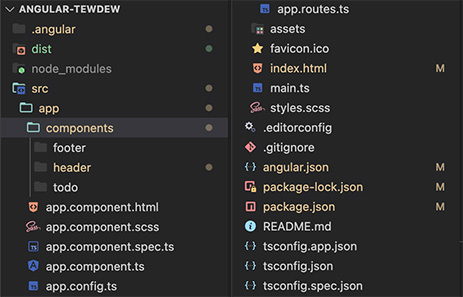

# TewDew
There’s an overabundance of To-Do apps that are overcomplicated and clutter the User Interface. Very few of these apps can do it like https://teuxdeux.com/. The TeuxDeux app is a personal, minimal To-Do app that allows for easy weekly/daily task setting. My TewDew app is my attempt at recreating the TeuxDeux app using Angular.

To deploy an Angular project to GH Pages, I followed this [tutorial](https://medium.com/tech-insights/how-to-deploy-angular-apps-to-github-pages-gh-pages-896c4e10f9b4).

Link to the website: [https://xamata.github.io/Angular-TewDew/](https://xamata.github.io/Angular-TewDew/).

# Project Structure📚
Three projects hold together this application: an ASP.NET Core Web App, a Class Library, and a SQL Server Database Project. It's a UI, Class Library, and Database. The structure of this project allows for any UI project to take the place of the ASP.NET Core Web App or an addition of several UI's. For example: a Web App to only allow reading the shift times, and a Desktop app to allow clock-ins and clock-outs.

Example of the folder structure::  
  
This project runs using the Angular core framework, ‘ng serve’ will have it up and running on a local port. There’s nothing special about this Angular 17 folder structure, but I did want to point out the way the components are organized. I like to keep them within a components folder i.e. _src/app/components_. I find this to be the best prevention of clutter.

# Future Versions🔮
- User Authentication
- SQL Database
- Task Manipulation (editing/rearranging)
- Reminders
